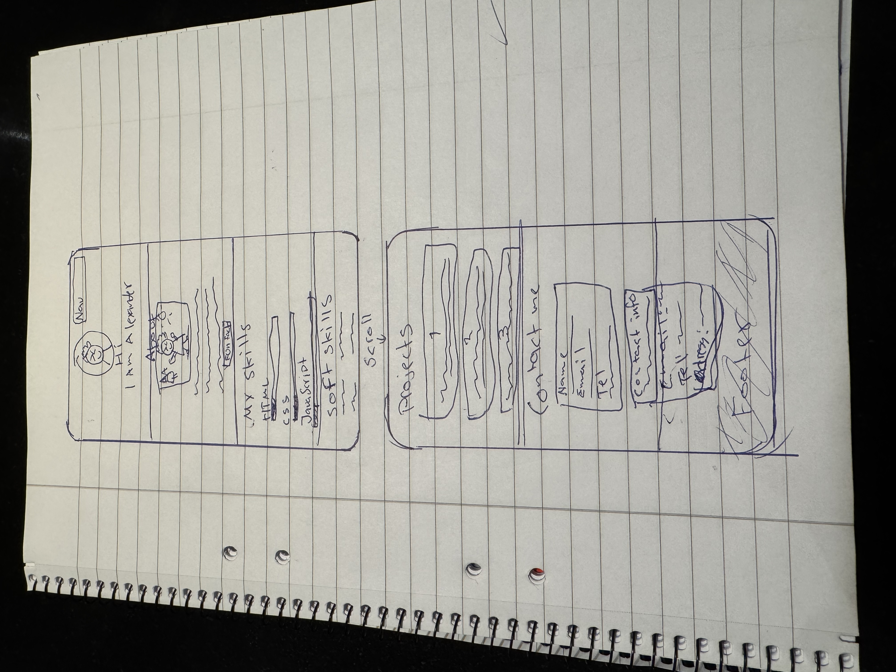
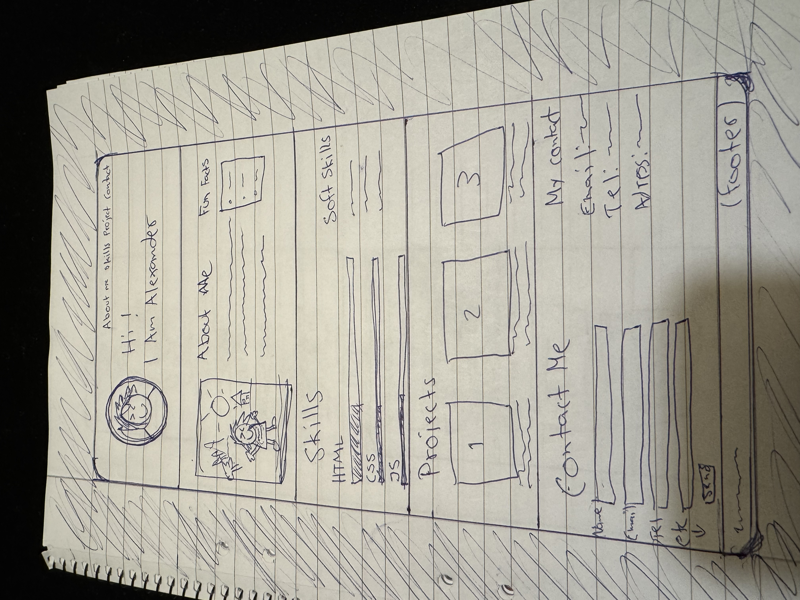
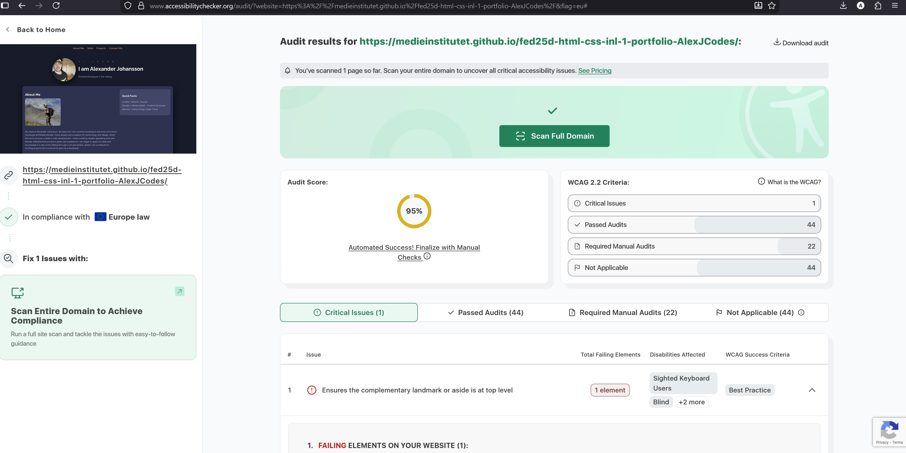
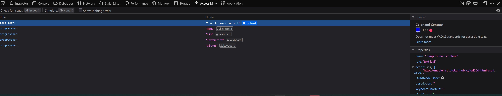
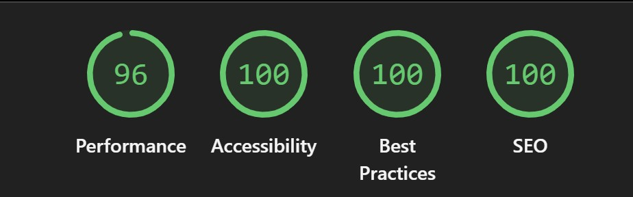

# Alexander Johansson - Portfölj

### Hej och välkommen till min README!

Jag presenterar här mitt projekt vilket är vår första inlämningsuppgift - en portfölj!

Mitt första problem i projekt blev en massa timmar för att hitta inspiration. Men.. genom en hel del bollande med klassen, men även pinterest och GitHub som hade många intressanta portföljer så lyckades jag spåna fram en idé.

Jag ville göra något stilrent och enkelt med subtila färger.

Det var viktigt för mig är att portföljen är lättnavigerad, tydlig och trevlig i mobil. Ett mål för mig var också att den skall gå att bygga vidare på.

## Initial skiss, papper och penna

### Mobil:

### Desktop:

### Kommentar:

Jag kunde följa mina skisser och idéer någorlunda under projektets gång, men jag fick göra vissa visuella ändringar längs vägen.

## Utmaningar

Under arbetets gång stötte jag på väldigt många utmaningar. Framförallt i CSS-delen för positionering. Med hjälp av klasskamrater i Discord, tips av Jenni i våra lektioner, CO-pilot i VSC och råd av ChatGPT lyckades jag få en bra struktur på min design och HTML.

Flexbox hjälpte mig otroligt mycket för mobile-first. Även Grid men vilket jag fortfarande tycker är svårt att få korrekt / förstå.

Vidare problem med a11y, samt perfomance:

<ul>
<li> En färg som spökade och inte mötte kravet för korrekt contrast. Detta var min accent-färg, alltså den orangea. Efter mycket letande lyckades jag hitta en lax-färgad ljusare ton.

<li> aside-elementet nästlade jag i en div vilket inte är OK enligt a11y. <strong>Lösning</strong> = Gör om gör rätt i HTML -> Ändra desktop layout i CSS. Quick-facts satte jag istället en role "note" på.

<li> Ingen "role" på mina skill-bars vilket blir tokigt i en tillgänglighetsaspekt. <strong>Lösning</strong> = Ge elementen en role. "progressbar", samt aria-labels och value vilket gör att en screenreader ser vad det handlar om.

<li> Performance var bra på desktop men ej i mobile. <strong>Lösning</strong> = Gör bilderna ännu mindre :) Genom Squoosh.
</ul>

### Bifogar bilder på a11y samt performance score via Lighthouse:

#### Accesibility-checker:

##### Källa, accesibilitychecker.org:

###### Kommentar:

Jag dras fortfarande med en critical då inte min aside ligger i top-level. Jag satte en role="note" på denna. Inte ok? :)

##### Firefox, a11y:

###### Kommentar:

1. Jump to main content - fel kontrast. Jag lade till en anchor-tag för skrivbordsanvändare.
2. Skill-bars. Får bara påbackning på denna genom firefox dev-tools. Aria attributen ligger där. Kluven.

#### Performance mobile:

#### Performance desktop:

## Reflektion och framtidstänk

Jag vill börja med att säga att det har varit ett otroligt roligt och nyttigt projekt. Mycket frustration i kodandet.. men också väldigt mycket glädje när man lyckas. Nästan lite adrenaline-artande :)

Tack för bra lektioner längs vägen! Utan dem hade jag inte kunnat färdigställa min portfölj.

##### Vad jag tar med mig till framtida projekt:

Jag började med min HTML. Byggde färdigt denna helt och hållet för att sedan börja med min CSS.

Nästa gång kommer jag att göra färdigt sektion för sektion för att sedan styla. Det kommer spara mig väldigt mycket tid och göra det enklare att navigera sig i VSC.

## Tack!
